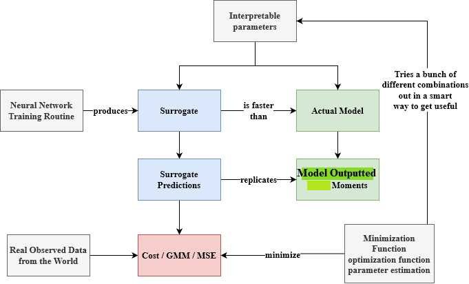
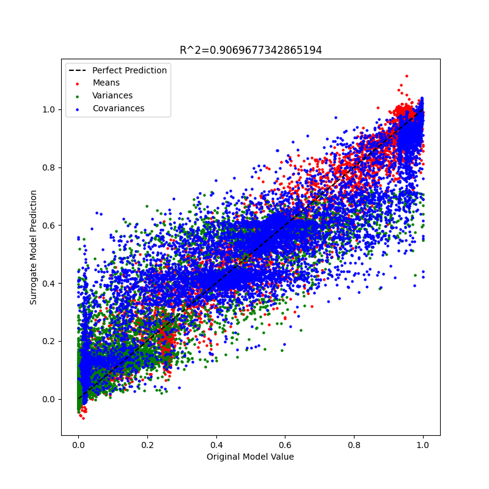

# ABMNet - Speeding Up Mechanistic Simulations with Surrogate Models

Training a neural network to act as a surrogate model for Agent Based Models to speed up the simulation of mechanistic models used in the Das Lab.

## What is Surrogate Modeling?
Simply put, surrogate modeling is when one designs a "surrogate" model, usually with some black-box method, that sufficiently approximates the behavior of a pre-existing model. Generally, speaking, surrogate models approximate models with some "mechanistic" or interpretable behavior such that its fast computations are of something meaningful. In this repository, we explore various different deep learning architectures for surrogate modeling. In particular, we take inspiration from the following paper [here](https://www.sciencedirect.com/science/article/pii/S016926072100153X) where a mapping is formed between cellular automata model parameters and its corresponding outputs. 

However, there exists many other approaches where some are more suitable than others. A review of surrogate modeling for finite element method computations can be found [here](https://link.springer.com/article/10.1007/s00500-022-07362-8). 

## Why Surrogate Modeling?
The big question one might ask is why create another model that models a model? While this seems like a very unnecessary roundabout step, especially when one considers the extra error in predictions resulting from adding an additional layer of abstraction, its speed benefits can not be neglected. See below for a quick example on the computational time needed to perform numerous simulations given a biochemical model and its surrogate model.

|                       | Nonlinear 6 Protein Model | Surrogate Model |
|-----------------------|---------------------------|-----------------|
| Number of Evaluations | 7,500                     | 2,344           |
| Time (s)              | 230                       | 0.104           |

The surrogate model was approximately 691 times faster than the original model. The surrogate model is capable of scaling up to far larger numbers of evaluations, which is commonly needed when performing parameter estimation and identification (which is just another way of saying optimization or fitting) tasks. For reference, the actual model was evaluated in parallel on a 30-core CPU on a high performance compute cluster whereas the surrogate model was ran on my laptop GPU, one a vastly cheaper compute platform. 

Here is a flowchart providing some contextual relationships as to how a surrogate relates to an actual mechanistic model and what we are using it for. 

## When does surrogate modeling work? 
We started with a simple reaction network of a linear 3 protein model shown below,

In this case, the reaction network contained 5 sets of reactions (each with their own reaction rates, the thetas) and 3 abundances values (P1, P2, and P3). Given some set of 5,000 initial conditions of 3 proteins, a new set of 5,000 final conditions of 3 proteins are simulated. Taking these final conditions, we can derive some vector of 9 moments (means, variances, and covariances) of the final conditions at some time t. We do these moment computations, because there exists intrinsic noise from the reaction network simulation (i.e Gillespie) and the extrinsic noise resulting from the set of initial conditions. While this toy problem, once examined, is quite simple (as it can be approximated by a system of linear ODEs), it provided a useful frame of reference for this surrogate modeling project, because it incorporates some of the aspects that one might encounter when performing biological simulations (namely noise).

And, so, when training the surrogate model on some 8,500 sets of parameter sets to moment pairs, and then evaluating on 1,500 parameter sets in the test set, we get something that looks like this with a relatively low test average MSE of 0.0301 (please note that the abundance values range on the order of magnitude of 10^2) and an r^2 plot as well as histogram that looks like the figures below. Note that each histogram plot corresponds to some type of moment (E(X), E(X^2) E(XY), etc.). 

Note: One should in principle do cross validation MSE loss (or some other metric) to get a better idea of how the surrogate model is truly performing (on average), but in this case, even with cross-validation, negligible generalization performance gains were seen (probably because the dataset contained a large number of parameter sets were sampled from some uniform distribution and thus were evenly spread out).

However, these plots while a useful litmus test, are not perfect. A better validation test is performing a parameter estimation task where one attempts to fit the surrogate model (and the actual model) to synthetically generated data with ground truth (as one would with real data). In this toy problem, we used particle swarm optimization to fit some synthetic observed data and we get the following parameter estimates. 

Furthermore, when creating cost contour plots where all thetas (or k's) are held constant at the simulated ground truth except for theta 4 and theta 5, one can observe that the mechanistic model's cost space is actually being well approximated by the surrogate. 

Please note that because running the true model is often more computationally expensive than the surrogate model, the cost contour of the true model is lower resolution. On the other hand, the surrogate contour cost space is much higher resolution due to its fast speed of computation. However, even so, the shapes of the cost contour functions within the parameter space of theta 4 vs. theta 5 are of similar shape. Furthermore, the darker shaded regions indicating lower cost surround the ground truth parameters. 

## Is there a good rule of thumb for hyperparameters to use and what about dataset size?
I had a highschooler do some experiments with different combinations of numbers of hidden neurons and layers in the deep surrogate models we've used for the linear 3 protein model. The results can be found [here](https://docs.google.com/presentation/d/1CTc9d6LX_MZa7NdIOZF8-M5sWEWQQNsOcqwZRSXIG6Q/edit?usp=sharing) (Thanks Soham!). Unfortunately, the only general advice I can give is that larger neural networks are required for more complex mechanistic models where nonlinearity is often present. The exact numbers of layers, neurons, and even architecture is heavily problem specific. 

Similarly, dataset size is also equally problem specific. Depending on the behavior and parameter sensitivity in the mechanistic model, the amount of data required can vary dramatically. For instance, in this simple toy linear 3 protein case, increasing the amount of data may not necessarily lead to drastically improved parameter estimates (or reduced generalization error). Take a look at the pairwise parameter cost contour figure below. 

## Does a successful surrogate model's weights have any meaning? 

I also had another highschooler (thanks Nityha!) investigate the weights of the trained deep surrogate models [here](https://docs.google.com/presentation/d/1VL2rcyGV5Rm35uWFStSB32m23w6q21PiF-u83gbDfnY/edit?usp=sharing). Considering most weights are centered around zero, there is a lot of work (and use of other interpretability methods) that needs to be done in understanding what is being learned within these black boxes.

## When does it fail? 

### Unbounded data where mechanistic output and input features vary across many orders of magnitude. 
As it turns out, difficulties in modeling neural networks after mechanistic models is well-known within the scientific machine learning community (link [here](https://arxiv.org/abs/2201.05624) for a review of related work). One such well-documented difficulty is in modeling unbounded systems where parameters and their corresponding model outputs differ across various orders of magnitude, which is often missing in conventional vision and NLP supervised learning tasks. Applying this surrogate deep learning approach to two stochastic (i.e gillespie) nonlinear models, one a spatial agent based model and the other a non-spatial nonlinear 6 protein reaction network, naively applying a neural network without any feature transformations (i.e standardization, min-max scaling, etc.) leads to very some remarkably poor results. Here are some early results of what the surrogate fits looked like for the two nonlinear models.

Schematics for Both Nonlinear Models.

Nonlinear 6 Protein Reaction Network Surrogate Fit

Spatial ABM (Giuseppe's Model Fit)

A way to mitigate these issues is to simply perform min-max scaling (or standardization) on the output feature vectors such that the feature space across all parts of the vector are bounded near 0. In the same order, we have the following improved fits

However, as one can see in the scatter plots, this still doesn't truly fully resolve all difficulties of fitting. There is still quite a bit of error surrounding the perfect fit line. While I haven't yet validated the nonlinear 6 protein reaction network's predictions with the actual model (as its fit isn't too bad), looking at the spatial ABM's fit, and one can reasonably assume it would have large approximation errors of the actual model and therefore be unsuitable for predictive purposes (and parameter estimation).  

### Building More Complex Surrogate Models (and Failing)
The arguably simplest method of building a direct mapping of parameters to some mechanistic outputs may not fully encompass the complex stochastic behaviors of certain models, especially when one considers biochemical reactions to be of time-series rather than simply just a snapshot in time and many models to have a spatial component. Such is the case with the spatial ABM depicted above. Unfortunately, I never had the time to truly explore all of the different conventional machine learning models (nor the time to use regularization methods such as dropout, L2 loss with the weights being a regularizer, etc.), here's a quick and dirty list of my naive attempts at using different neural network architectures for different mechanistic models and some statements on some things that I've noticed but never had the time to make graphicals for. 

#### GCNs and GATs
Exploring graph convolutional neural networks and graph attention networks used to act as a surrogate model for Giuseppe's model has shown that naive guesses are often just that, naive guesses. In particular, in a spatial ABM (or gillespie), a specific pixel (or position on a grid) has a variety of ways to update based on its neighboring pixels, and therefore in a way, it acts like a node on a graph. As such, one can (naively) imagine, that using graph neural networks where nodes are updated through some forwarding method and also nonlinearly transformed by some sets of weights (and their corresponding nonlinear activation functions), would do a reasonable job in acting as a surrogate for a spatial agent based model. The following architecture attempted with the surrogate model and their corresponding fits are shown below.

Architecture for GCN and GAT (note that the GCN unit is interchangeable with the GAT).

Their corresponding GCN and GAT fits respectively.

Here's what it looks like when you color code them by their moment type.

##### Possible Future Directions
Please note that the dots size may mislead you to believe that the "test" fits are 

#### LSTMs (Indrani's Network Free pZap and Ca Model)

#### Transformer Models (Indrani's Network Free pZap and Ca Model)

##### Shortcut Learning

## How to use the code written in this repository (more for Das lab members than anyone else)?

To those in the Das lab that might be taking up the flag in developing this project further, for a quickstart, one can simply look in the /tutorials/tutorial_for_indrani.pynb notebook for a quick rundown on how one might use the pieces of code written. There's also a cli interface that I've provided with main.py, please look in the slurm_scripts/ folder for a plethora of shell scripts used to run the code on the cluster. The flow chart below provides a general workflow of the surrogate modeling done in this repository.

Please look in the modules/ folder for relevant pieces of code.

## Other potential future directions (that I wish I had taken the time for), taking inspiration from the general machine learning communities. 

### Feature Engineering 

### Generative Adversarial Networks

### Reinforcement Learning

### Larger Neural Network Architectures

### Ensemble Neural Network Methods

### Papers from related fields that attempt to do something similar to what we're doing

### Transfer Learning
Since it is now the era of fine-tuning and "pre-training" in the NLP and vision fields, it's interesting that it hasn't heavily spread into the domain of scientific machine learning. There could be various reasons for this, but ultimately, if one could in principle take a pre-trained surrogate model and fine-tune it to properly surrogate another similar related mechanistic model, one could in principle speed up training by 100x. It's interesting to note that people are already attempting to do this for deterministic mechanistic models as seen with the physics-inspired neural networks. 

### AutoML
I've tried this with no luck in actually getting some of their packages to run, and I figured at the time, it wasn't worth further exploring. But, if you can simply blackbox the training approach, and it works, I don't see why not giving it a [shot](https://www.automl.org/automl/).